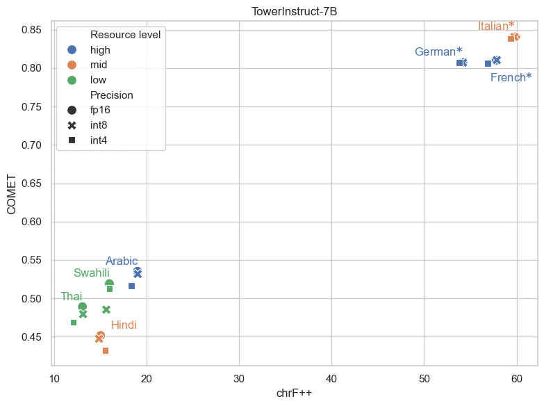

# Lost-in-compression

  

Welcome to the official repository for our DL4NLP project "**Lost-in-compression**", a project to determine the impact of quantization on the performance of pretrained translation models on different languages (grouped by resource availablity).

The code in this repository contains all the scripts (creating pseudo-quantization models, getting translations from models, computing scores), results and the analysis we performed for the project.

## Table of Content
- [Installation Guide](#installation-guide)
- [Datasets](#datasets)
- [How to Run](#how-to-run)
  - [Creating Pseudo Quantization models](#creating-pseudo-quantization-models)
  - [Generating Model Translations and Scores](#generating-model-translations-and-scores)

## Installation Guide
<ol type=1>
<li> Download the repository as a .zip or clone the repository using:
 git clone git@github.com:raya-mez/Lost-in-compression.git
</li>
 
<li> Run the remaining steps <b>only if</b> running the code on local machine:
<ol type='a'>
<li> Install the correct version of the used packages from the .yml file using the following command:
<b>conda env create -f dl4nlp.yaml</b>
</li>
<li> Upon installation of the environment, it can be (de)activated using:
<b>conda activate dl4nlp_env</b>
 
<b>conda deactivate dl4nlp_env</b>
</li>

<li> The environment can be deleted using:
<b>conda remove -n dl4nlp_env --all</b>
</li>

<li> Additional packages can be installed using pip:
<b>pip install [package_name]</b>
</li>
</ol>
<li> If running on <b>Snellius</b> create and run slurm file using the dl4nlp_env.yaml file provided.
</li>
</ol>

## Datasets
The WMT24++ dataset is used for evaluating the models and is downloaded dynamically via the code (based on the lang_pairs parameter passed when running the scripts) and do not need to be separately downloaded.

## How to Run
Now that the environment has been correctly installed, it is time to run the code.

### Creating Pseudo Quantization models

You can perform pseudo-quantization on the Llama or Tower-Instruct model by running the create_pseudo_quant_model.py file with appropriate command line arguments.

The following command line arguments are available for use:

<ol type=1>
  <li> model_id_key - This argument is used to specify the pretrained model to use on which pseudo-quantization will be performed. It's default value is 'tower_instruct'. It can take one of the following values: 'tower_instruct' and 'llama_chat'.</li>
   
  <li> precision - This argument is used to specify the download precision for the pretrained model. It's default value is 'fp16'. It can take one of the following values: 'fp16', 'bf16', 'int8' and 'int4'.</li>
   
  <li> kbit_cfg_group_size - This argument is used to specify the group size for KBitConfig wrapper (for symmetric quantization and scaling). It's default value is 64. It can take integer values.</li>
   
  <li> run_for_k_range - This argument is used to specify whether we are creating pseudo quantization models for a range of bits. It's default value is True. It can take one of the following two values: True and False.</li>
   
  <li> target_k - This argument is used to specify the upper bound for bit range (in case running for a range) or the exact bit value (if not running for a range) for pseudo quantized model. It's default value is 16. It can take any positive integer value lesser than equal to 16.</li>
   
  <li> result_base_dir - This argument is used to specify the directory name where all the results are being stored. It's default value is '../results/'.</li>
</ol>

### Generating Model Translations and Scores

You can perform pseudo-quantization on the Llama or Tower-Instruct model by running the create_pseudo_quant_model.py file with appropriate command line arguments.

The following command line arguments are available for use:

<ol type=1>
<li> model_id_key - This argument is used to specify the model for which translations and scores need to be generated. It's default value is 'tower_instruct'. It can take one of the following three values: 'tower_instruct', 'llama_chat' and 'pseudo_quant.</li>
 
<li> lang_pairs - This argument is used to specify the language pairs for which translation needs to be generated. It's default value is ["en-fr_FR", "en-de_DE", "en-it_IT", "en-hi_IN", "en-sw_KE", "en-th_TH"]. It can take a list of full language codes per the WMT24++ dataset.</li>
 
<li> precision - This argument is used to specify the download precision for the pretrained model. It's default value is 'fp16'. It can take one of the following values: 'fp16', 'bf16', 'int8' and 'int4'.</li>
 
<li> pseudo_quant_precision - This argument is used to specify the list of bits (for which pseudo-quantized models have been generated and translations and scores need to be calculated). It's default value is [1, 2, 3, 4, 5, 6, 7, 8, 9, 10, 11, 12, 13, 14, 15, 16]. It can take a list of integers with the constraint that the integers are lesser than equal to 16.</li>
 
<li> batch_size - This argument is used to specify the batch_size the model processes at once. It's default value is 16. It can take any positive integer value. Ideally should be 16, 32, 64 or 128. Higher batch_sizes require more computational power.</li>
 
<li> direction - This argument is used to specify whether we are translating from English or translating to English. It is only applicable when model_id_key is llama_chat. For tower_instruct and pseudo_quant models, the direction as of now is only English to target language. It's default value is 'en2xx'. It can take one of the following two values: 'en2xx' and 'xx2en'.</li>
 
<li> limit - This argument is used to specify the number of records to consider from the total data for any language. It's default value is 0 meaning that all the data will be processed. It can take any positive integer value lesser than 998 (the records per language in the WMT24++ dataset).</li>
 
<li> skip_bad - This argument is used to specify whether we need to drop rows from language data (in WMT24++ dataset) where is_bad_source == True. It's default value is True. It can take one of the following two values: True and False.</li>
 
<li> result_base_dir - This argument is used to specify the directory name where all the results are being stored. It's default value is '../results/'.</li>
 
<li> test_one_batch - This argument whether we are running the code in spot test mode or not. If it is True, the process is run for only a single batch. It's default value is False. It can take one of the following two values: True and False.</li>
 
<li> num_examples_print - This argument is used to specify the number of examples to print for quick spot check. It's default value is 5. It can take any positive integer value.</li>
</ol>

The results will be saved in dedicated folders for specified model and precision (created automatically by the code).
